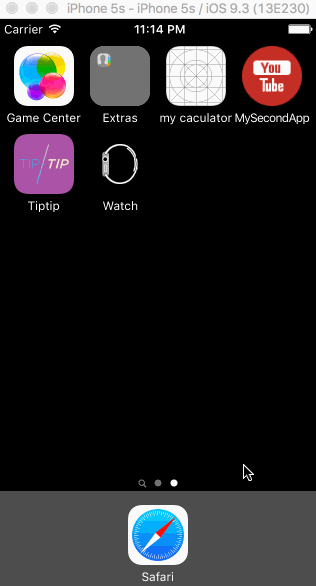

# Pre-work - *Tiptip*

**Tiptip** is a tip calculator application for iOS.

Submitted by: **Rachel Jin**

Time spent: **8** hours spent in total

## User Stories

The following **required** functionality is complete:
* [ ] User can enter a bill amount, choose a tip percentage, and see the tip and total values.

The following **optional** features are implemented:
* [ ] Custom font
* [ ] UI animations
* [ ] Making sure the keyboard is always visible and the bill amount is always the first responder. This way the user doesn't have to tap anywhere to use this app. Just launch the app and start typing.

The following **additional** features are implemented:

- [ ] Automatically calculate the tax amount
- [ ] Design an icon for the app

## Video Walkthrough 

Here's a walkthrough of implemented user stories:

GIF created with [LiceCap](http://www.cockos.com/licecap/).

## Notes

Describe any challenges encountered while building the app.
The main challenge for me is to figure out basic concepts of Swift, such as the difference between Outlets and Actions.
The most intesting part is to make some simple animation.

## License

    Copyright [2016] [Rachel Jin]

    Licensed under the Apache License, Version 2.0 (the "License");
    you may not use this file except in compliance with the License.
    You may obtain a copy of the License at

        http://www.apache.org/licenses/LICENSE-2.0

    Unless required by applicable law or agreed to in writing, software
    distributed under the License is distributed on an "AS IS" BASIS,
    WITHOUT WARRANTIES OR CONDITIONS OF ANY KIND, either express or implied.
    See the License for the specific language governing permissions and
    limitations under the License.
